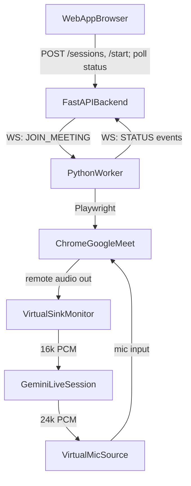

# Meeting Agent - Phase 0 (Join, Hear, Speak)

## Goal

Deliver the "recommended first build" from the PRD:

> Paste a Google Meet link in the web app -> the worker machine joins the Meet -> someone says "Can you hear me?" -> the agent waits for silence and answers out loud.

Only the voice foundation. No Trello, files, browsing, or screen share yet (those are later phases).

## Scope decisions (baked in)

- **OS-agnostic worker**: audio device names come from config/env. We document two setups: Linux (PipeWire null sinks, this machine) and macOS (BlackHole). Worker code doesn't hardcode either.
- **Turn-taking via Gemini Live built-ins**: use the Live API's automatic VAD + proactive audio to decide when to respond, instead of building a custom VAD first (PRD FR-0.8/FR-0.9). Custom silence gating is a fallback only if needed.
- **State is in-memory** in the backend (no Postgres/Redis for Phase 0).
- **Single session, single worker** (matches PRD non-goals).

## Architecture (Phase 0)




Audio loop: Chrome plays remote participants -> captured from the virtual sink monitor -> streamed to Gemini Live -> Gemini's spoken reply played into the virtual mic -> Chrome sends it into Meet as the agent's voice.

## Repository layout (new)

```
raiseHack/
  backend/            # FastAPI: REST + worker WebSocket, in-memory session store
    main.py
    sessions.py
    ws_worker.py
  worker/             # Python worker (PRD section 17 modules)
    main.py
    config.py
    websocket_client.py
    meet_controller.py     # Playwright: open Chrome profile, join Meet
    audio_router.py        # capture from virtual sink, play to virtual mic
    gemini_live_client.py  # google-genai Live session, VAD/proactive audio
    status.py              # worker state machine + status reporting
    requirements.txt
  web/                # Next.js + Tailwind single-page control panel
  docs/
    AUDIO_SETUP.md    # Linux PipeWire + macOS BlackHole instructions
  README.md
```

## Component details

### 1. Backend (FastAPI)

- `POST /sessions` -> create in-memory session `{id, meeting_url, status}` (PRD 16).
- `POST /sessions/{id}/start` -> push `JOIN_MEETING` command over the worker WebSocket.
- `GET /sessions/{id}` -> return current status + last event (browser polls this).
- `WS /worker` -> single worker connects; backend forwards commands and records incoming `STATUS` events. Track `worker online/offline`.
- Status vocabulary from PRD FR-0.3: `worker_offline, worker_connected, joining_meeting, in_meeting, listening, speaking, error`.

### 2. Worker (Python)

- `websocket_client.py`: outbound WS to backend, auto-reconnect, sends heartbeat + status.
- `meet_controller.py`: Playwright with a **persistent Chrome context** (pre-logged-in agent Google account), navigates the Meet URL, sets display name if needed, clicks "Join now". Pre-grant mic/camera permission for `meet.google.com` on the profile to avoid prompts.
- `audio_router.py`: use `sounddevice`/PyAudio; capture from the virtual sink monitor (resample to 16kHz mono PCM), play Gemini output (24kHz) to the virtual mic source. Device names from `config.py`/env.
- `gemini_live_client.py`: `google-genai` `client.aio.live.connect(model="gemini-live-2.5-flash-native-audio", ...)`, `response_modalities=["AUDIO"]`, automatic VAD on, proactive audio + a concise meeting-assistant system prompt (PRD FR-0.10). Stream mic-side PCM in via `send_realtime_input`, read audio chunks out.
- `status.py`: worker state machine (PRD 17 states) -> emits status to backend.

### 3. Web app (Next.js + Tailwind)

- Single page: Meet-link input, "Start Agent" button, live status badge, last-event line.
- Calls backend REST; polls `GET /sessions/{id}` every ~1s for status. (Browser WebSocket is a nice-to-have, polling is sufficient for the demo.)

### 4. Audio setup docs (`docs/AUDIO_SETUP.md`)

- **Linux (PipeWire)**: create null sinks `meet_out` (Chrome output) and `agent_mic` (Chrome mic input); worker records from `meet_out.monitor`, plays to `agent_mic`. Point Chrome/Meet output to `meet_out` and mic to `agent_mic`.
- **macOS (BlackHole)**: BlackHole 2ch + Multi-Output device; select BlackHole as Meet mic; capture Chrome output.
- Include the "prevent feedback / agent hearing itself" note (PRD section 18): we capture only Chrome's remote-participant output, so the agent's own mic isn't looped back.

## Milestones (map to PRD section 22)

1. Worker <-> backend WebSocket; web app shows worker "online" (M1).
2. Paste link -> `JOIN_MEETING` -> agent account visibly joins the Meet (M2).
3. Capture Meet audio; worker detects speech (M3).
4. Play a test phrase into Meet; humans hear it (M4).
5. Wire Gemini Live end-to-end; answer spoken questions with silence-aware turn-taking (M5).

## Phase 0 done criteria (PRD section 20)

Paste link -> worker joins -> "Can you hear me?" -> agent waits for silence -> "Yes, I can hear you." Then handles ~5 basic spoken questions without constantly interrupting.

## Key risks (from PRD section 21)

- **Audio routing is the top risk** - validate "can hear" and "can speak" independently (test-tone playback + level meter) before connecting Gemini.
- **Meet UI automation is fragile** - fixed pre-logged-in Chrome profile, pre-granted permissions, Playwright with a screenshot/coordinate fallback if selectors break.
- **Agent interrupts / echo** - rely on Gemini VAD + proactive audio, capture only remote audio, keep replies short.

## Prerequisites to confirm before building

- A `GEMINI_API_KEY`.
- An agent-only Google account already logged into the Chrome profile used by the worker.
- A Trello-free Meet test room for repeated testing.
- Final decision on which machine runs the worker (affects which audio-setup path in `docs/AUDIO_SETUP.md` we actually configure).

