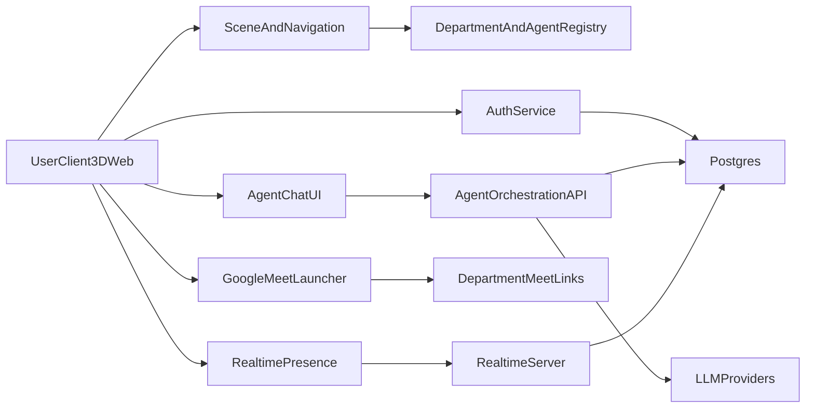

# AI Office Platform Two-Phase Plan

## Product Scope

- **Core concept**: A 3D company building where each department contains specialized agents (frontend, backend, QA, ops, etc.) represented like teammates.
- **Phase 1 (MVP)**: 3D navigation, department/agent discovery, real-time presence, agent chat, and Google Meet launch links.
- **Phase 2**: Built-in voice/video communication inside the platform.

## Recommended Technical Stack

- Frontend: React + Next.js + TypeScript + React Three Fiber (`@react-three/fiber`) for 3D building.
- Realtime layer: WebSocket-based pub/sub (e.g., Supabase Realtime or Socket.IO).
- Backend API: Node.js (Next.js API routes or separate service) with agent orchestration layer.
- Data: Postgres (departments, agents, rooms, chats, users, sessions).
- Auth: Clerk/Auth0/Supabase Auth (email + Google SSO).
- AI agents: Persona-driven agent registry (single orchestration backend that routes prompts by agent role).
- Meetings:
  - Phase 1: Google Meet deep links per agent/department room.
  - Phase 2: WebRTC stack (or LiveKit) for embedded calls.

## High-Level Architecture

## Phase 1 Implementation Plan (MVP)

### 1) Foundation and Project Setup

- Create monorepo/app scaffold and baseline folders:
  - `[apps/web](apps/web)`
  - `[apps/api](apps/api)` (or `[apps/web/src/app/api](apps/web/src/app/api)` if single app)
  - `[packages/shared](packages/shared)`
- Add CI checks (lint, typecheck, tests) and environment templates.

### 2) 3D Building + Department Navigation

- Implement base 3D scene with floors/departments as interactive zones.
- Add click/hover selection and side panel for department details.
- Seed initial department data and agent cards with statuses.
- Suggested key files:
  - `[apps/web/src/features/scene/BuildingScene.tsx](apps/web/src/features/scene/BuildingScene.tsx)`
  - `[apps/web/src/features/departments/DepartmentPanel.tsx](apps/web/src/features/departments/DepartmentPanel.tsx)`
  - `[apps/web/src/data/departments.ts](apps/web/src/data/departments.ts)`

### 3) Agent Directory + Role Personas

- Define agent schema: `id`, `name`, `role`, `departmentId`, `personaPrompt`, `tools`, `availability`.
- Build backend agent registry and role-based routing.
- Support “agents for every kind” via configurable personas per role (frontend/backend/devops/security/etc.).
- Suggested key files:
  - `[apps/api/src/agents/registry.ts](apps/api/src/agents/registry.ts)`
  - `[apps/api/src/agents/router.ts](apps/api/src/agents/router.ts)`
  - `[packages/shared/src/types/agent.ts](packages/shared/src/types/agent.ts)`

### 4) In-App Chat With Department Agents

- Create chat UI per selected agent/department.
- Add streaming AI responses and conversation persistence.
- Include context injection from department metadata.
- Suggested key files:
  - `[apps/web/src/features/chat/ChatPanel.tsx](apps/web/src/features/chat/ChatPanel.tsx)`
  - `[apps/api/src/routes/chat.ts](apps/api/src/routes/chat.ts)`
  - `[apps/api/src/services/conversation-store.ts](apps/api/src/services/conversation-store.ts)`

### 5) Real-Time Multi-User Presence

- Broadcast online users, active department, and optional avatar position.
- Show who is currently in each department.
- Handle reconnect/resync and stale presence cleanup.
- Suggested key files:
  - `[apps/web/src/features/presence/usePresence.ts](apps/web/src/features/presence/usePresence.ts)`
  - `[apps/api/src/realtime/presence.ts](apps/api/src/realtime/presence.ts)`

### 6) Google Meet Launch Integration

- Add “Start/Join Meet” CTA on agent/department panels.
- Store per-department Meet URLs and permissions.
- Track join events for analytics.
- Suggested key files:
  - `[apps/web/src/features/meet/MeetLauncher.tsx](apps/web/src/features/meet/MeetLauncher.tsx)`
  - `[apps/api/src/routes/meet.ts](apps/api/src/routes/meet.ts)`

### 7) MVP Security and Access Controls

- Add auth + role checks (employee/admin).
- Restrict editing agent personas to admins.
- Apply rate limiting and moderation guardrails for chat.

### 8) MVP Validation and Launch Criteria

- Functional checks: navigate departments, chat with each agent persona, see live presence, open Meet links.
- Performance target: maintain responsive FPS in 3D scene under normal load.
- Reliability target: realtime reconnect succeeds after temporary network drop.

## Phase 2 (Post-MVP): Built-In Voice/Video

- Add embedded voice/video rooms per department or ad-hoc team room.
- Start with 1:many room model, then add breakout rooms/screen share.
- Extend presence model to include speaking state and call participants.
- Suggested key files:
  - `[apps/web/src/features/calls/CallRoom.tsx](apps/web/src/features/calls/CallRoom.tsx)`
  - `[apps/api/src/realtime/call-signaling.ts](apps/api/src/realtime/call-signaling.ts)`

## Delivery Milestones

- **Milestone A (Week 1-2)**: Foundation + 3D departments + seeded agent directory.
- **Milestone B (Week 3-4)**: Agent chat + persistence + role-based routing.
- **Milestone C (Week 5)**: Real-time presence + Meet launch integration.
- **Milestone D (Week 6)**: Hardening, QA, and internal pilot.
- **Phase 2 kickoff**: Embedded calls implementation after MVP feedback.

## Hackathon Execution (24h, 5 People)

### Team Split

- **Person 1 - 3D Frontend Owner**
  - Build base scene, camera controls, department hotspots, and selection UX.
  - Wire selected department/agent state for other modules.
  - Deliverable: stable 3D navigation with clickable departments.
- **Person 2 - Agent Chat Backend Owner**
  - Implement agent registry/personas (frontend, backend, DevOps, QA, etc.).
  - Build chat API with role-based routing and streaming responses.
  - Deliverable: working per-agent chat endpoint and persona behavior.
- **Person 3 - Realtime Presence Owner**
  - Implement socket/realtime channels for online users and department occupancy.
  - Add reconnect logic and stale session cleanup.
  - Deliverable: live “who is where” indicators in UI.
- **Person 4 - Meetings + Calls Owner**
  - Implement Google Meet launch flow and department/agent meeting links.
  - Build minimal embedded voice/video proof-of-concept as phase-2 slice.
  - Deliverable: reliable Meet launch plus basic in-app call demo path.
- **Person 5 - Integrator + UX/QA Owner**
  - Set up repo, shared types, env config, CI checks, and integration branch strategy.
  - Own auth stub/simple login, route guards, end-to-end sanity tests, and demo polish.
  - Deliverable: merged vertical slice, stable demo script, fallback plan.

### Timeline (UTC+2)

- **Hour 0-2 (Architecture + Setup)**
  - Person 5 scaffolds project, shared contracts, and branch conventions.
  - Persons 1-4 align on interfaces: agent schema, presence events, meeting payloads.
- **Hour 2-10 (Parallel Build Block)**
  - Person 1: 3D scene and department interaction.
  - Person 2: chat backend + personas + initial prompts.
  - Person 3: realtime presence backend/frontend hook.
  - Person 4: Meet launcher + call POC baseline.
  - Person 5: auth/light guards + shell UI + integration harness.
- **Hour 10-14 (First Integration)**
  - Merge to integration branch; fix type/API contract mismatches.
  - Lock MVP path: navigation -> select agent -> chat -> see presence -> launch Meet.
- **Hour 14-20 (Stabilize + Feature Completion)**
  - Person 1: performance/interaction polish.
  - Person 2: response quality + guardrails.
  - Person 3: presence edge cases/reconnect.
  - Person 4: in-app call path polish (if stable), otherwise reinforce Meet path.
  - Person 5: regression test matrix, loading/error states, demo flows.
- **Hour 20-24 (Demo Hardening)**
  - Freeze scope, bug bash, fallback switches, and pitch walkthrough recording.
  - Prepare contingency mode: disable in-app video toggle if unstable, keep Meet as primary.

### Definition of Done (Hackathon)

- User can move in 3D building and open at least 3 departments.
- User can pick at least 6 role-based agents and chat with distinct behavior.
- Two browser sessions show realtime presence updates.
- Meet launch works from both department and agent cards.
- Optional in-app voice/video POC works for demo; if not, hidden behind feature flag.

### Critical Interface Contracts (Decide Early)

- `Agent`: `id`, `name`, `role`, `departmentId`, `personaPrompt`, `status`.
- `PresenceEvent`: `userId`, `departmentId`, `state`, `timestamp`.
- `MeetLink`: `departmentId`, `agentId?`, `url`, `label`.
- `ChatRequest`: `agentId`, `conversationId`, `message`, `context`.

### Merge Strategy

- Use one integration branch with scheduled merges at Hour 10 and Hour 18.
- No long-lived divergence: each owner ships thin slices behind feature flags.
- Person 5 approves integration readiness using checklist before final merge.

## Risks and Mitigations

- 3D performance on low-end devices -> Add quality presets and lightweight models.
- Agent consistency across many roles -> Central persona templates and eval prompts.
- Realtime complexity -> Keep first version to presence + state sync only.
- Voice/video complexity -> Isolate into phase 2 with explicit signaling boundaries.

## Immediate Next Step

- Bootstrap repository and implement the vertical slice: one floor, two departments, four specialized agents, chat + presence + Meet launch end-to-end.

