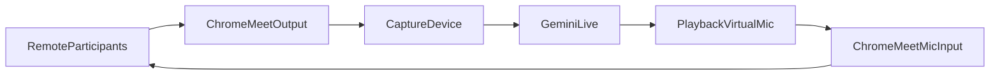

# Audio Setup

The worker needs two virtual audio devices so it can **hear** the meeting and
**speak** into it without a physical mic/speaker:

- **Capture** device: what the worker hears = the remote participants' audio
  that Chrome/Meet plays out. The worker records from this and streams it to
  Gemini Live.
- **Playback** device: what the worker speaks into = a virtual microphone that
  Chrome/Meet uses as its mic input. Gemini's spoken reply is played here.

We deliberately capture only Chrome's output (remote participants). Meet never
plays your own mic back to you, so the agent does not hear itself and we avoid a
feedback loop (PRD section 18).

The worker resolves devices by name from these environment variables:

```
CAPTURE_DEVICE=...    # substring match of the input device name
PLAYBACK_DEVICE=...   # substring match of the output device name
```

Run `python worker/verify_audio.py devices` to list device names/indices.



---

## Linux (PipeWire) - this machine

No drivers needed. Create two null sinks and use their monitors.

```bash
# 1. A sink whose monitor the worker records (Meet output goes here)
pactl load-module module-null-sink \
  sink_name=meet_out sink_properties=device.description=meet_out

# 2. A sink that acts as the agent's virtual microphone
pactl load-module module-null-sink \
  sink_name=agent_mic sink_properties=device.description=agent_mic
# Expose agent_mic as a capture source Chrome can pick as its mic
pactl load-module module-remap-source \
  master=agent_mic.monitor source_name=agent_mic_src \
  source_properties=device.description=agent_mic_src
```

Then:

- In Chrome/Meet **audio output**, select `meet_out` (so participants' audio is
  routed into the capturable sink). You can also route just the Chrome app via
  `pavucontrol` -> Playback -> set the Chrome stream output to `meet_out`.
- In Chrome/Meet **microphone**, select `agent_mic_src`.
- Worker env:

```bash
export CAPTURE_DEVICE="meet_out.monitor"
export PLAYBACK_DEVICE="agent_mic"
```

Tip: use `pavucontrol` to visually confirm which stream goes where. To monitor
the meeting yourself while testing, load `module-loopback` from
`meet_out.monitor` to your real speakers.

Unload modules when done: `pactl unload-module <id>` (list with `pactl list short modules`).

---

## macOS (BlackHole) - dedicated Mac

```bash
brew install blackhole-2ch
```

1. Open **Audio MIDI Setup** -> **+** -> **Create Multi-Output Device**. Check
   both **BlackHole 2ch** and your speakers/headphones, with **BlackHole 2ch as
   the master (clock) device**. Set this Multi-Output Device as the system
   output so Chrome's Meet audio flows into BlackHole (and you still hear it).
2. In **Meet -> Settings -> Microphone**, select **BlackHole 2ch** (the agent's
   virtual mic).
3. Worker env:

```bash
export CAPTURE_DEVICE="BlackHole"
export PLAYBACK_DEVICE="BlackHole"
```

> BlackHole runs at 48 kHz. sounddevice/PortAudio will negotiate the requested
> 16 kHz/24 kHz rates through the OS; if you hit a sample-rate error, create the
> Multi-Output/Aggregate device with a matching rate or adjust the rates in
> `worker/config.py`.

---

## Verify before wiring Gemini (PRD milestones M3, M4)

```bash
# M4: participants should hear a test tone from the agent
python worker/verify_audio.py speak

# M3: watch the level meter move when someone talks in the meeting
python worker/verify_audio.py listen
```

Only after both work independently should you run the full worker.
